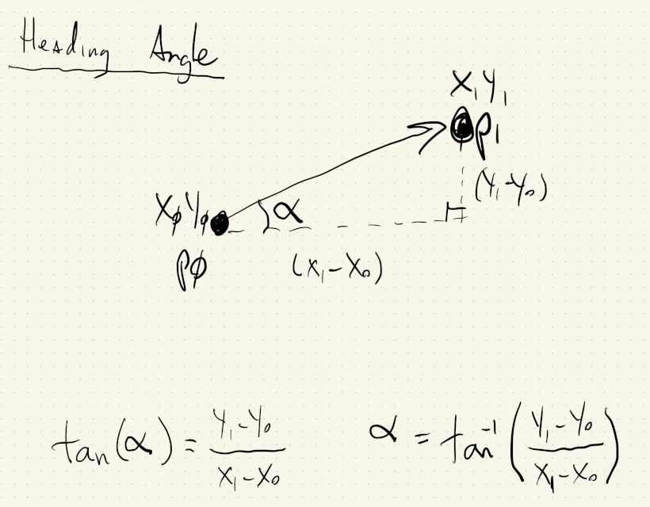
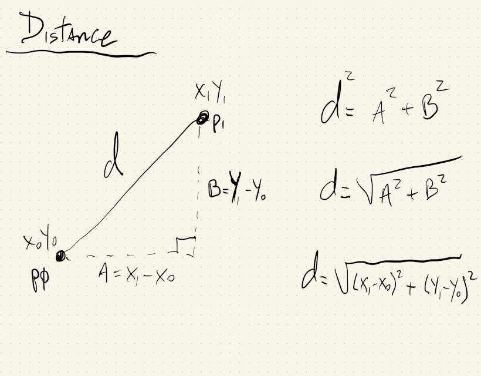

# HW06

I implemented Sol LeWitt's Wall Drawing 118 again, but this time it's interactive and drawn using only text.


I used JavaScript objects to keep track of x and y coordinates for each point, as well as their time of creation and a desired delay between when letters show up during the animation.

I mixed up Wall Drawing 118 and Wall Drawing 1180, which mentions a circle on the wall, and that's why I have the letters for the word "circle" in my background. 🤦🤷

There were a couple of challenges to achieve this:

1. After the 2 random points are chosen, I had to calculate the angle between them in order to rotate the canvas and draw the word "line" in the correct direction. This was achieved using the function ```atan2()``` that gives the angle between points in a cartesian plane.

2. I used some trial-and-error to figure out how to calculate the number of times the letter "i" should be repeated to cover the distance between two points.

3. To animate the lines, I use their time of creation and ```millis()``` to get the total elapsed time. This can then be divided by the letter delay to calculate how many letters should be drawn during the current frame.

Angle between points:


Distance between points:

